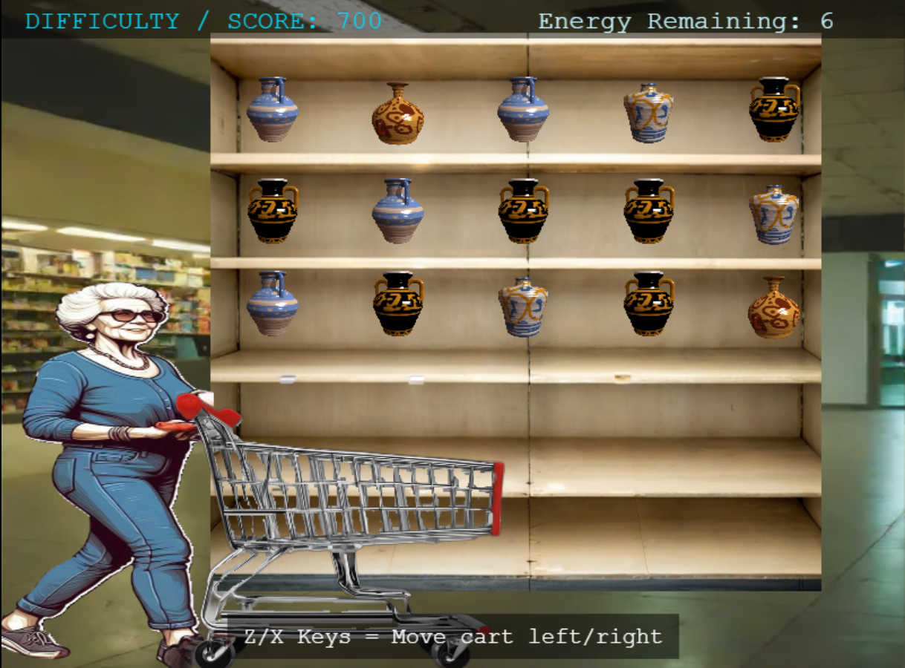
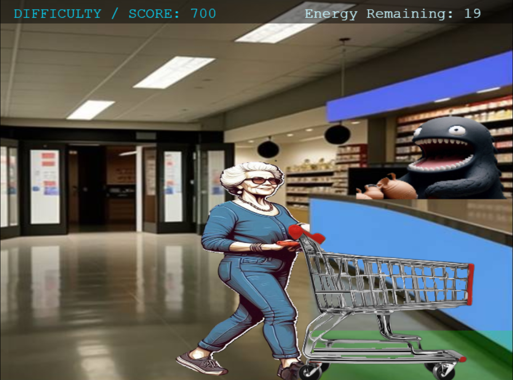
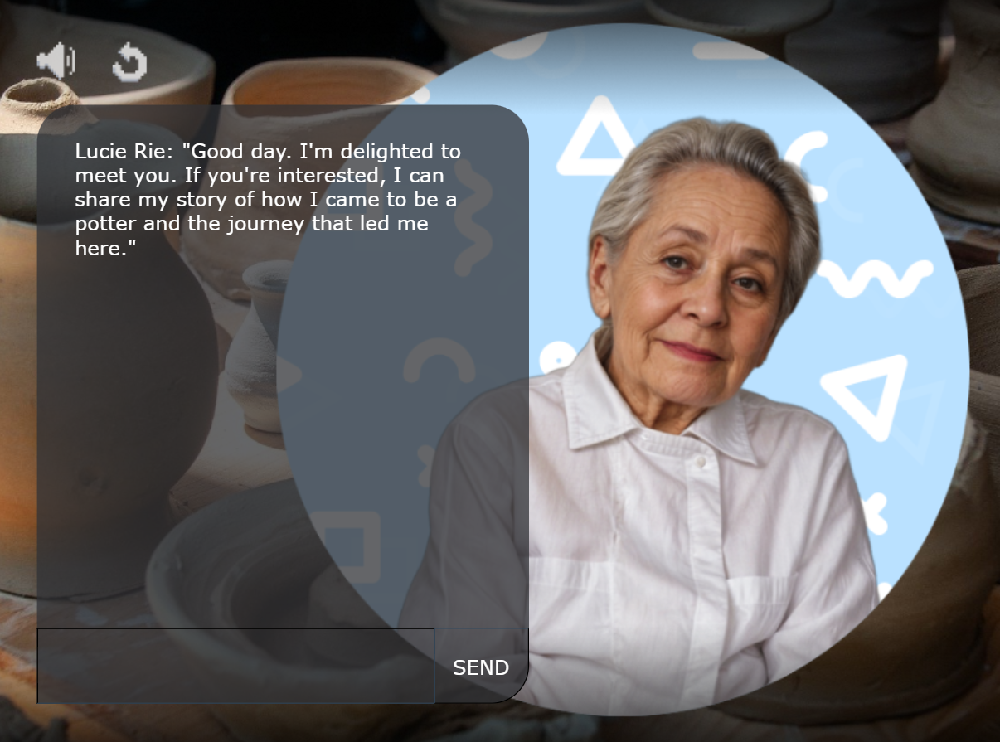

# Lucie-Rie---Pottery---Intership-Game

## Overview

"Interactive Art: The Journey of Lucie Rie" is an educational and immersive game that takes players through the life of Lucie Rie, from her early days fleeing Austria during World War II to her rise as a celebrated potter and artist. The game aims to foster empathy and understanding of the refugee experience through interactive storytelling and captivating visuals inspired by Lucie Rie’s unique journey and artistic style.

## Internship Project

This game is developed as part of an internship project, with the primary goal of creating an impactful and informative game using Rosebud AI and the Phaser game framework. The project merges technical skill development with creative storytelling to produce a meaningful educational tool.

## Features

- **Educational Content**: Discover the life of Lucie Rie and the challenges faced by refugees.
- **Interactive Scenes**: Navigate different paths and pivotal moments in Lucie Rie’s life through engaging gameplay.
- **Cultural Design**: Experience a rich atmosphere with vibrant colors and elements inspired by modern ceramics and 20th-century art.
- **Story-Driven Gameplay**: Unlock various scenes and events as you progress through Lucie Rie's journey.

## Technology Stack

- **Rosebud AI**: Used for generating assets and enhancing the creative process.
- **Phaser**: A powerful framework for developing 2D games, used to build and run the game.

## Live link

[https://costea47.github.io/Lucie-Rie---Pottery---Intership-Game/](https://costea47.github.io/Lucie-Rie---Pottery---Intership-Game/)

## Live on RosebudAI

[https://play.rosebud.ai/games/09e7e075-b643-4a60-9608-609b508dd9c4](https://play.rosebud.ai/games/09e7e075-b643-4a60-9608-609b508dd9c4)

## Usage

The following images show the challenge appearance and functionality:

## License

This project is licensed under the MIT License. See the [LICENSE](LICENSE) file for more details.

## Acknowledgements

- Special thanks to the Rosebud AI team for their support and resources.
- Inspired by the life and legacy of Lucie Rie.
